# Table of Contents

### How to Use

1. [Interacting with Sungear](#interacting-with-sungear)
2. [Control Dialog](#control-dialog)
3. [Genes Dialog](#genes-dialog)
4. [GO Terms Dialog](#go-terms-dialog)
5. [Sungear Dialog](#sungear-dialog)
6. [GeneLights Dialog (optional)](#genelights-dialog)

### Definitions

1. [Anchors](#anchors)
2. [Vessels](#vessles)
3. [GO Terms](#go-terms)

### Troubleshooting

### Data Files

1. [Sungear data file Documentation](#creating-sungear-files)
2. [Adding new data (experiments, species, hierarchies) to Sungear](#adding-new-data-type-to-sungear)

### Interfacing with Sungear from third-party applications

1. [Data exchange using a web application](#sungear-http-interface)

## Interacting with Sungear

#### Selecting

Almost all dialogs in Sungear allow the selection of elements or groups of elements. Selected elements will often highlight or affect values seen across all the dialogs.

For Mac users:
* `alt` = options/alt key
* `ctrl` = apple key

#### Basic

* `left click`: select an item in a list, or a vessel or anchor inside the sungear dialog.
* `shift left click`: select a range of items in a list. Left Click the first item of the range then Shift Left Click on the final item to select the range.

#### Advanced

Once the basics of selecting have been mastered there are two additional types of selection in Sungear that allow more control over the data.
* `ctrl left click`: Unions an anchor/vessel/term with a previous selection. From then on, toggles between selecting all or none of the genes in the anchor/vessel/term.
* `ctrl alt left click`: Starts a multiple select for union and intersection. Performing this action will highlight the union and the Intersection buttons in the control dialog. Once elements have been selected pressing the Union or Intersection button finishes the command.
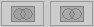

## Control dialog

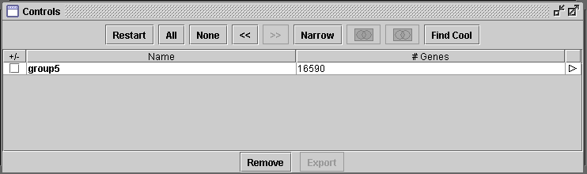

#### What you are seeing

The general management tool for sungear data.
* `Restart`: reloads data set
* `All`: select all groupings
* `None`: select no groupings
* `<<` : Go backward to a previous selection
* `>>` : Go forward to a selection
* `Narrow`: Create a new group based on selected elements and clears selection history.
* `Union` 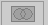 : Union two or more selected elements. Select multiple elements using `ctrl-alt left-click`, then click _Union_.
* `Intersect` 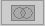 : Intersect two or more selected elements. Select multiple elements using `ctrl-alt left-click`, then click _Intersect_.
* `Find Cool`: Find the vessel consisting of the most overrepresented set. The results are saved after the first click. If saved results are available, the button will read "Show Cool".
* `Export`: Export data set
* `View Group` 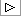 : View this group

## Genes Dialog

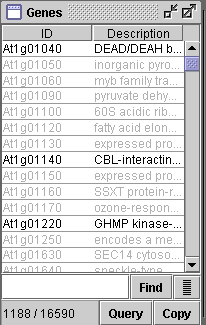

#### What you are seeing

The main part of the genes dialog is the table that contains ID and Description. This gives you the gene ID and the description. Selecting a gene from this list will highlight associated vessels in the Visualizations dialog. Also selections made from the Visualizations dialog will highlight the corresponding genes in the genes dialog.

The numbers in the lower left corner represent the number of genes selected and the total number of genes in the current group, chosen by a narrow or a view group operation, just like at the lower right of the sungear dialog.

## GO Terms Dialog

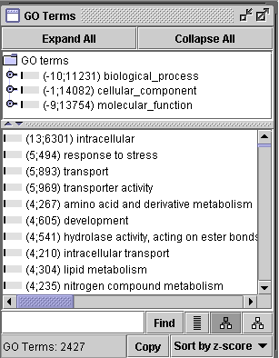

#### What you are seeing

The upper window shows the GO Terms, in hierarchal fashion, that can be selected.

The bottom window shows the GO Terms in list fashion sorted by z-score.

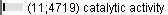 The bar to the left is a visual representation of the number of selected genes for that term, relative to the total number of genes for that term in the current group. The number on the left is the z-score. The number on the right is the total number of genes for that term.

## Sungear Dialog

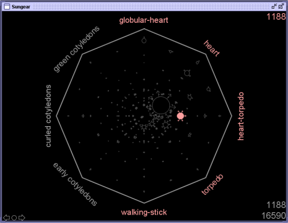

#### What you are seeing

Anchors are names you see circling the display. Vessels are in the center. The number in the upper right hand corner is the number of selected genes in the current highlighted vessels/anchors. The numbers in the lower right hand corner are the number of genes selected and the total number of genes respectively. In the lower left hand corner are arrows that allow you to move backwards and forwards through anchors.

## GeneLights Dialog

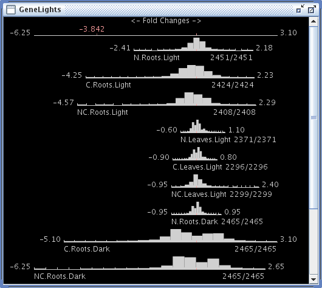

#### What you are seeing

Some experiments provide extra data to enable the GeneLights window, which can be opened by navigating to View | GeneLights. Given a value for each gene and experiment, GeneLights displays the distribution values for each experiment as a histogram shown above. Typical biological values are gene expression, or a function thereof such as the (log) fold change in expression. When the user selects a set of genes in another window, GeneLights highlights that set in the histogram, leaving the full set genes visible in a shadow histogram (similar to how selection of some genes in a vessel is show in the Sungear window).

Clicking on a bar in a histogram in the GeneLights window selects the genes with that value. `ctrl-click` on additional bars in any histogram will select additional sets of genes. Clicking and dragging on a histogram will select genes in that range for that experiment, and clicking and draggin in the top area selects genes in that range across all experiments.

## Definitions

### Anchors

A list of genes corresponding to some outcome of an experiment (e.g. the induced genes). Anchor terms can be seen surrounding the visualization circle in the sungear dialog.

### Vessels

List of genes in the intersection of the anchors to which that vessel points and that are not in the intersection of any superset of those anchors. Selecting a vessel highlights the genes in the [Genes Dialog](#genes-dialog) as well as all anchors associated. Size depends on the ratio of genes found inside the vessel compared to the total number of genes in the last created group.

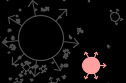

### GO Terms

Gene Ontology Terms, name for genes that participate in particular functions.

## Troubleshooting

Uh...

## Creating Sungear Files

1. [Sungear Data File](#sungear-data-file)
2. [Gene/Case Definition File](#genecase-definition-file)
3. [Group Definition File](#group-definition-file)
4. [Group Hierarchy File](#group-hierarchy-file)
5. [Element to Group File](#group-to-element)
6. [GeneLights File](#genelights-file)

### General Information

There are four files that are required for Sungear to load a Sungear file. There is a file for defining the genes, the groups, how the groups are organized, and which groups will have which elements.

Comments are allowed at the beginning of each file, but not afterwards, in the from of beginning bracket and end bracket.

Example: `{ comments in here }`

Delimiters are pipes and in some instances spaces, `|` and ` `.

Files can be named with any or no extension.

### Sungear Data File

This file contains two parts, the header and the data. The header contains a list of the anchor names and a name for the elements. The anchor names will be displayed on the sungear dialog within the application. Element identification should be unique.

#### Examples

* [Gene Example](examples/example.sun.txt)
* [Baseball Example](../data/batting2004.txt)

### Gene/Case Definition File

This file contains element identification and any other information you wished to be displayed about the elements. The element identification should be unique and will be used by the Sungear Data File and the Elements to Groupings File.

#### Formal Definition

`ElementID | [Any Information]`

#### Examples

* [Gene Example](examples/example.annotation.txt)
* [Baseball Example](../data/players.txt)

### Group Definition File

This file contains group names and any other information you wish displayed about the groups.

#### Formal Definition

`GroupName | [Any Information]`

#### Examples

* [Gene Example](examples/example.groups.txt)
* [Baseball Example](../data/teams-annot.txt)

### Group Hierarchy File

This file contains how the groups are organized in a hierarchy. This is done by giving the group name followed by a list of groups that are underneath. This file can be blank but must be provided.

#### Formal Definition

`GroupName | [GroupName [GroupName]*]`

#### Examples

* [Gene Example](examples/example.hier.txt)
* [Baseball Example](../data/teams-hier.txt)

### Group to Element

This puts all elements into the appropriate group. Elements may be put into separate groups.

#### Formal Definition

`Group Name | Z Score | [Element]*`

#### Examples

* [Gene Example](examples/example.2group.txt)
* [Baseball Example](../data/team2player.txt)

### GeneLights

A GeneLights file has a similar format to the Sungear file. It specifies a value (e.g. log fold change in expression) for each element across a range of conditions, or `NA` if the value is unknown. Generally the conditions will be the same as the Sungear anchors, but this is not required. The GeneLights file will be automatically recognized and loaded if it has the same name as the Sungear file with the additional of a `.gl` suffix.

#### Example

* [Gene Example](examples/example.sun.gl)

## Adding new data type to Sungear

1. [Adding a new experiment](#adding-a-new-experiment-to-sungear)
2. [Adding a new species](#adding-a-new-species-to-sungear)
3. [Adding a new hierarchy](#adding-a-new-hierarchy-to-sungear)

### Adding a new experiment to Sungear

If you have a local installation of Sugnear, you can add new experiments to the list of experiments in the `File | Load` list by adding lines to the `exper.txt` file. Each line of the file describes a single experiment as follows:

`Experiment ID | File Name | Description [ | species]`

`Experiment ID` must be unique across all experiments in the file. `File name` gives the path, relative to the data directory, of the Sungear data file. `Description` is the description displayed in the experiment list. The optional `species` designation is required for any species other than the default arabidposis.

### Adding a new species to Sungear

Addinga new species to Sungear is a fairly simple process, however, completing the process requires interaction with the Sungear team. There are three stages to the process.

First, prepare a list of genes and descriptions as described in the [Gene/Case Definition File](#genecase-definition-file) section.

Second, a "gene-to-go" (Element-to-Group) file that associates genes with GO terms must be created. The format of this file is similar to the other Sungear files described in [Creating Sungear Files](#creating-sungear-files). Each line of this file consists of a gene ID, followed by a delimiter, and then zero or more GO terms with which that gene is associated:

`Gene ID | [GO Term ID]*`

Once these files are created, they need to be processed to generate a Group-to-Element file from the Eleent-toGroup file. Notify the team using the contact form on the main upload page, or open a new issue on the GitHub page. We will contact you and tell you how to send us the files. Once we have the files, we will translate the Element-to-Group file into our [Group to Element](#group-to-element) format, which includes a pre-calculated number used for on-the-fly calculation of z-scores for GO terms.

After we process this file, the new species will appear in the pull-down list on the main upload page, and any file prepared according to the Sungear Data File rules can be uploaded and viewed in Sungear.

### Adding a new hierarchy to Sungear

There are two steps to adding a new hierarchy (set of groups) to Sungear. The first is the creation of the two group files described in [Creating Sungear Files](#creating-sungear-files): Group Definition File and Group Hierarchy File. Typically these will be generated programmatically (e.g., the GO hierarchy files were generated by a program designed to read the [Gene Ontology](http://geneontology.org/) `.obo` file).

The second step is to generate a new "species" by following the instructions above for adding a new species. In Sungear, the term "species" refers to a unique combination of gene (element) definitions and groups. For example, arabidopsis with TAIR annotations and the GO hierarchy would be one species; arabidopsis with TAIR annotations and the [Plant Ontology](http://www.plantontology.org/) hierarchy would technically be another species; and arabidopsis with the GO hierarchy and another set of annotations (e.g., UniProt vs. HGNC for human) would be a third species.

## Sungear HTTP Interface

__This section is under construction, we plan to offer results in JSON format.__

Sungear can both receive information from and send information to web-based applications. This information is in the form of name-value paris (NVPs) that are passed to and from Sungear.

Input NVPs are taken from the query string used to open the Sungear application. Any attribute used by Sungear can be passed as a query string NVP. The most relevant ones for users are:

* __data\_url__: If this NVP is present, Sungear will assume that `data_url` specifies the location (properly escaped) of the file it should open upon starting.
* __species__: The species of the data file given by `data_url`, which must be a recognizable Sungear species.
* __export\_url__: If this NVP is present, Sungear's data export functionality (from the groups list) will be enabled. All data will be sent to the URL specified by `export_url` as a form POST.
* __export\_*__: Additional parameters to be sent back to the server with the form POST can be specified as query string NVPs starting with the string `export_`. These parameters will be stripped of the `export_` prefix as sent be to the server. For example, the query string NVP `export_cmd=addGroup` will be sent with the form post as `cmd=addGroup`.

Output NVPs in the form post consist of a list of groups, a list of genes, and any extra NVPs supplied by the user with the prefix of `export_`. For groups and gene data, the separator character is the pipe (`|`) character. The exact format of the group list and gene lists is as follows:

* `groups=group1|group2| ... `: a pipe-separated list of the groups being sent.
* `group1=gene1|gene2| ... `: a pipe-separated list of the genes belonging to a group. One such list is send for each of the groups in the `group` list.

Sungear also expects a response to the form POST. The response can be an empty page, but there must be data available for Sungear to read. The response can also optionally contain the following NVPS:

* __url__: If Sungear is being run as an application, it will display the contents of this URL after a form submission. By default, the application will be replaced by the new URL.
* __target__: An optional tag that specifies the target browser frame for the url.

An example form reply would look like this: `url=/sungear/done.html&target=status`. This would cause Sungear to display the local URL `sungear/done.html` in the window or frame named `status`.
